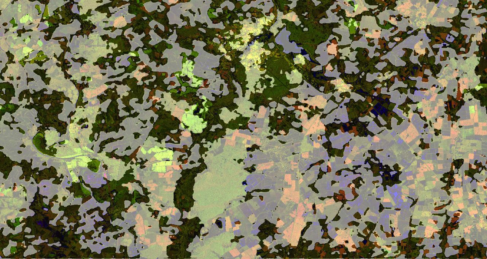
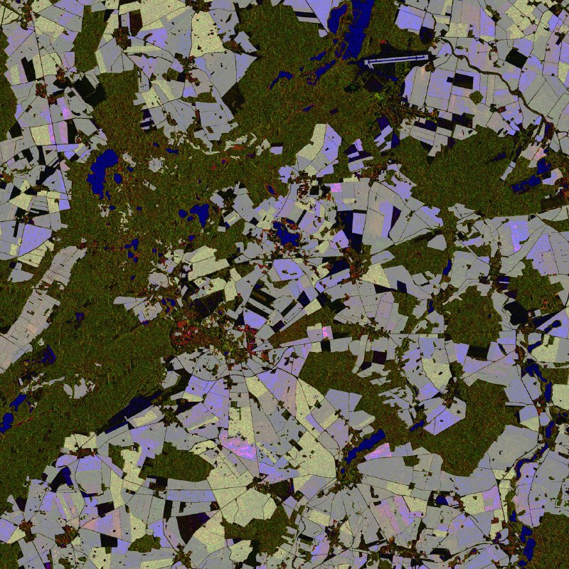

# Segmentation C-SAR
## About project
This repository provides codes for training and testing algorithms for semantic segmentation of objects on C-band radar images, income from satellite Sentinel-1.
The following architectures of convolutional neural networks are presented in the repository:
* <b>U-Net</b>
* <b>DeeplabV3+</b>
* [<b>MPResNet</b>](https://github.com/ggsDing/SARSeg/blob/main/models/MPResNet.py)
* [<b>IncFCN</b>](https://github.com/ggsDing/SARSeg/blob/main/models/Inc_FCN.py)

The following convolutional networks are used as basic networks for segmenters:
* <b>ResNet-34/ResNet-50</b>
* <b>Xception</b>

Used as a machine learning framework PyTorch. 
Agricultural fields are selected as segmentation objects in the images.

During training, the following variations of network training policies were used:
1) Loss functions
* Dice
* BCE
* Dice + BCE
* Focal
2) Optimizers
* Adam
* AdamW
* RMSProp
* SGD

## Installation and running
### Installation
<b>NOTE:</b> Installation instructions are provided for Linux. 

Install the virtual environment in the project:

```console
pip3 install -r requirements.txt
```
You can also run the project in [Docker container](https://hub.docker.com/layers/205311502/nikkotov98/kotov_sar/dev/images/sha256-24d34b590033f8fdf8f2a50c8042bd3c8cb3491fe7d43bbdb7e0cd5714751d94?context=repo).
Pull docker image from repository:
```console
docker pull nikkotov98/kotov_sar:dev
```
Create a docker container based on the downloaded image:
```console
docker run -it --gpus all -v /local_data_root/:/docker_data_root/ /local_code_root/:/docker_code_root/ --name container_name nikkotov98/kotov_sar:dev
```
You can also use the official image from Nvidia:
```console
docker pull nvcr.io/nvidia/pytorch:21.06-py3
```
### Running
Start training the corresponding algorithm with the following command (optionally, the output of the terminal is written to the log file):
```console
python3 train_xxx.py &> log_name.log
```
Start testing the corresponding algorithm on the saved scales with the following command:
```console
python3 test.py
```
Segmentation of a large satellite image with the chosen architecture and the chosen stored weights is done by the script:
```console
python3 segment_full_image.py
```
## Results
Examples of the operation of the segmentation algorithm are presented (performed using the network <b>DeeplabV3+</b> with base network <b>ResNet-50</b>).
<table style="width: auto; margin: auto;">
    <td></td>
    <td></td>
</table>
Test results for networks by <b>Dice</b> and <b>F1</b> metrics:
<table>
   <tr>
    <th>&nbsp;</th>
    <th>Dice</th>
    <th>F1</th>
   </tr>
   <tr>
    <td>Deeplabv3+/ResNet34</td>
    <td>0.665</td>
    <td>0.598</td>
  </tr>
   <tr>
    <td>Deeplabv3+/ResNet50</td>
    <td>0.686</td>
    <td>0.621</td>
  </tr>
   <tr>
    <td>Deeplabv3+/Xception</td>
    <td>0.668</td>
    <td>0.605</td>
  </tr>
  <tr>
    <td>IncFCN</td>
    <td>0.722</td>
    <td>0.669</td>
  </tr>
  <tr>
    <td>MPResNet</td>
    <td>0.666</td>
    <td>0.603</td>
  </tr>
  <tr>
    <td>U-Net/ResNet34</td>
    <td>0.689</td>
    <td>0.624</td>
  </tr>
  <tr>
    <td>U-Net/ResNet50</td>
    <td>0.5</td>
    <td>0.603</td>
  </tr>
 </table>

The weights of the trained networks can be downloaded from the [Yandex.Disk](https://disk.yandex.ru/d/9TtzMad52VAVig).